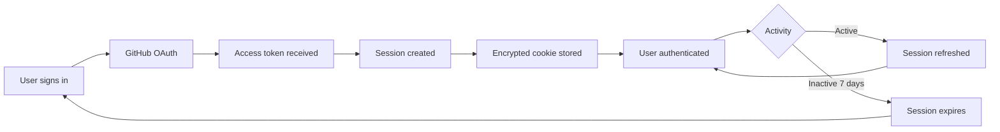

Who To Bother uses GitHub OAuth to authenticate contributors. This allows the application to create pull requests on your behalf without requiring you to manually fork repositories or use Git commands.

## Why GitHub Authentication?

GitHub authentication serves several purposes:

<CardGroup cols={2}>
  <Card title="Automatic Forking" icon="code-fork">
    The system automatically forks the repository to your GitHub account
  </Card>
  <Card title="PR Creation" icon="git-pull-request">
    Creates pull requests on your behalf with your changes
  </Card>
  <Card title="Identity Verification" icon="shield-check">
    Ensures contributions are attributed to the correct GitHub user
  </Card>
  <Card title="Seamless Workflow" icon="wand-magic-sparkles">
    No need to use Git commands or leave the website
  </Card>
</CardGroup>

## Authentication Flow

<Steps>
  <Step title="User initiates sign-in">
    Click "Sign in with GitHub" on the contribute page
  </Step>
  
  <Step title="GitHub OAuth redirect">
    You're redirected to GitHub to authorize the application
  </Step>
  
  <Step title="Grant permissions">
    Authorize the app to access your public repositories and user information
  </Step>
  
  <Step title="Return to application">
    GitHub redirects you back with an access token
  </Step>
  
  <Step title="Session created">
    A secure, stateless session is created using encrypted cookies
  </Step>
</Steps>

## Better Auth Configuration

Who To Bother uses [better-auth](https://www.better-auth.com/) for authentication. The configuration is straightforward and secure:

```typescript src/lib/auth.ts
import { betterAuth } from "better-auth";
import { tanstackStartCookies } from "better-auth/tanstack-start";

export const auth = betterAuth({
  // GitHub OAuth provider
  socialProviders: {
    github: {
      clientId: process.env.GITHUB_CLIENT_ID || "",
      clientSecret: process.env.GITHUB_CLIENT_SECRET || "",
      // Request public_repo scope for creating PRs
      scope: ["read:user", "user:email", "public_repo"],
    },
  },

  // Stateless session configuration (no database required)
  session: {
    expiresIn: 60 * 60 * 24 * 7, // 7 days
    updateAge: 60 * 60 * 24, // 1 day
    cookieCache: {
      enabled: true,
      maxAge: 60 * 60 * 24 * 7, // 7 days cache duration
      strategy: "jwe", // Encrypted tokens for security
      refreshCache: true, // Enable stateless refresh
    },
  },

  // Store account data in cookie for stateless OAuth
  account: {
    accountLinking: {
      enabled: true,
    },
    storeStateStrategy: "cookie",
    storeAccountCookie: true, // Includes access tokens
  },

  plugins: [tanstackStartCookies()],
});
```

### Key Features

**Stateless Sessions**: No database required. All session data is stored in encrypted JWT cookies.

**OAuth Scopes**: The app requests minimal permissions:
- `read:user` - Read your public GitHub profile
- `user:email` - Access your email address
- `public_repo` - Create and manage forks and PRs in public repositories

**Encrypted Storage**: Session data and access tokens are encrypted using JWE (JSON Web Encryption).

**Auto-refresh**: Sessions automatically refresh to keep you logged in for up to 7 days.

## Accessing the Session

The application uses better-auth's client-side hooks to check authentication status:

```typescript Example Component
import { useSession } from "@/lib/auth-client";

function ContributePage() {
  const { data: session, isPending } = useSession();

  if (isPending) {
    return <div>Loading...</div>;
  }

  if (!session) {
    return <div>Please sign in to continue</div>;
  }

  return (
    <div>
      <p>Welcome, {session.user?.name}</p>
      {/* Show contribution form */}
    </div>
  );
}
```

## Getting the Access Token

When creating a pull request, the server retrieves the GitHub access token from the session:

```typescript src/app/api/github/create-pr.ts
import { auth } from "@/lib/auth";

async function getAccessToken(request: Request): Promise<string> {
  // Verify session exists
  const session = await auth.api.getSession({
    headers: request.headers,
  });

  if (!session) {
    throw new Error("Unauthorized");
  }

  // Get GitHub access token
  const tokenResponse = await auth.api.getAccessToken({
    body: {
      providerId: "github",
    },
    headers: request.headers,
  });

  if (!tokenResponse?.accessToken) {
    throw new Error("No access token returned");
  }

  return tokenResponse.accessToken;
}
```

## Security Considerations

<Warning>
  Access tokens are sensitive credentials. Better-auth stores them securely in encrypted cookies and they're never exposed to client-side JavaScript.
</Warning>

### How Access Tokens Are Protected

**Encrypted Storage**: Tokens are encrypted using JWE before being stored in cookies.

**HTTP-Only Cookies**: Session cookies are HTTP-only, preventing access from client-side JavaScript.

**Secure Flag**: Cookies are marked secure in production, ensuring they're only sent over HTTPS.

**Short-Lived Sessions**: Sessions expire after 7 days of inactivity.

**Minimal Scopes**: The app only requests the minimum permissions needed to function.

### Token Usage

Access tokens are only used server-side for:

1. **Forking the repository** to your GitHub account
2. **Creating branches** in your fork
3. **Committing changes** to company data files
4. **Opening pull requests** to the main repository

<Tip>
  You can revoke the application's access at any time from your [GitHub Settings → Applications](https://github.com/settings/applications).
</Tip>

## Environment Variables

To set up authentication in your own deployment, configure these environment variables:

```bash .env
GITHUB_CLIENT_ID=your_github_oauth_app_client_id
GITHUB_CLIENT_SECRET=your_github_oauth_app_client_secret
```

### Creating a GitHub OAuth App

<Steps>
  <Step title="Navigate to GitHub Developer Settings">
    Go to [GitHub Settings → Developer settings → OAuth Apps](https://github.com/settings/developers)
  </Step>
  
  <Step title="Create a new OAuth App">
    Click "New OAuth App" and fill in the details:
    - **Application name**: Who To Bother (or your app name)
    - **Homepage URL**: `https://your-domain.com`
    - **Authorization callback URL**: `https://your-domain.com/api/auth/callback/github`
  </Step>
  
  <Step title="Copy credentials">
    After creating the app, copy the Client ID and generate a Client Secret
  </Step>
  
  <Step title="Add to environment">
    Add the credentials to your `.env` file
  </Step>
</Steps>

## Session Management

### Session Lifecycle



### Checking Session Status

The session is automatically validated on each request:

```typescript src/app/api/github/fork.ts
const session = await auth.api.getSession({
  headers: request.headers,
});

if (!session) {
  return new Response(
    JSON.stringify({ error: "Unauthorized" }),
    { status: 401 }
  );
}
```

### Sign Out

Users can sign out at any time, which clears the session cookie:

```typescript Example Sign Out
import { authClient } from "@/lib/auth-client";

async function handleSignOut() {
  await authClient.signOut();
  // User is now signed out
}
```

## Troubleshooting

### "Unauthorized" Error

If you see an unauthorized error:

1. Try signing out and signing back in
2. Check if your session has expired (7 day limit)
3. Ensure cookies are enabled in your browser
4. Clear your browser cache and try again

### "GitHub access token not found"

This error occurs when the access token can't be retrieved from the session:

1. Sign out and sign back in to re-authorize
2. Check that you granted all requested permissions during OAuth
3. Verify the GitHub OAuth app is configured correctly

### Session Not Persisting

If you're repeatedly asked to sign in:

1. Check if third-party cookies are blocked
2. Ensure your browser allows cookies for the domain
3. Verify you're accessing the site over HTTPS in production

<Note>
  For development, ensure `BETTER_AUTH_SECRET` is set in your environment. This secret is used to encrypt session data.
</Note>

## Next Steps

<CardGroup cols={2}>
  <Card title="Submit Changes" icon="git-pull-request" href="/community/submitting-changes">
    Learn how to submit your first contribution
  </Card>
  <Card title="Contributing Guide" icon="book-open" href="/community/contributing">
    Return to the main contributing guide
  </Card>
</CardGroup>
